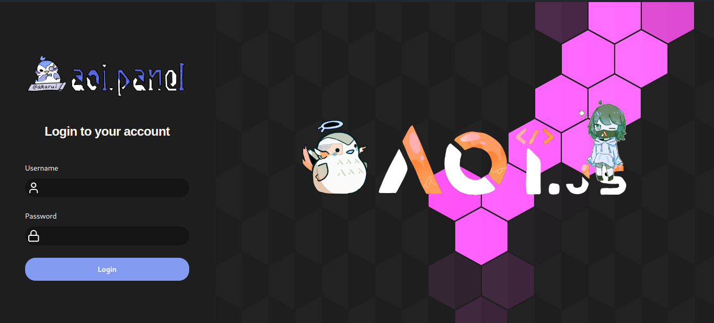
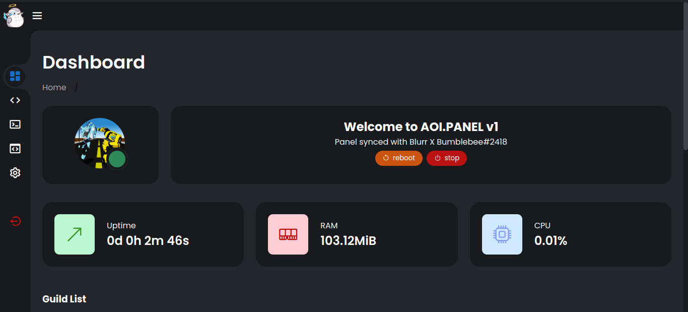
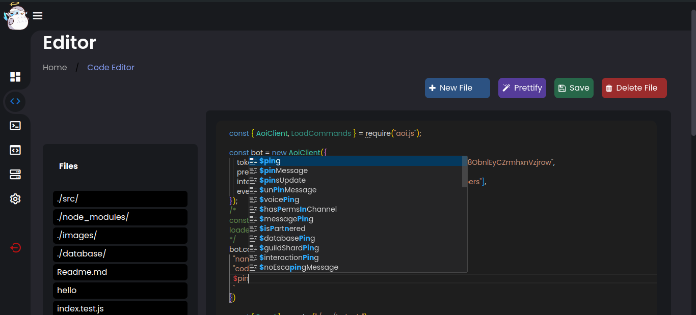
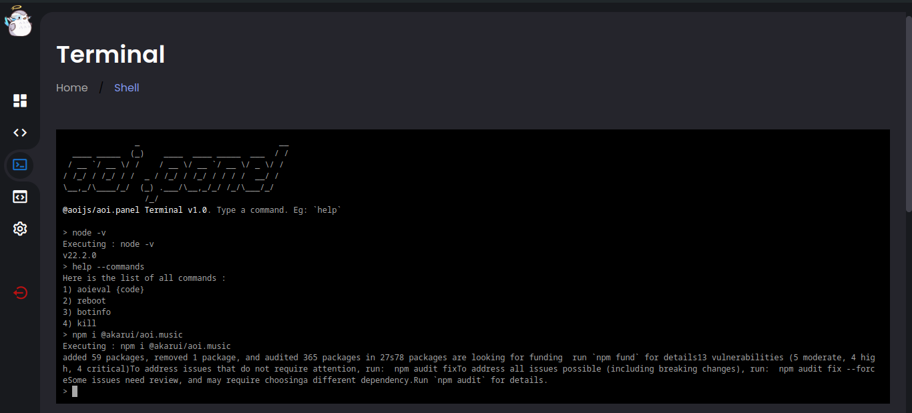
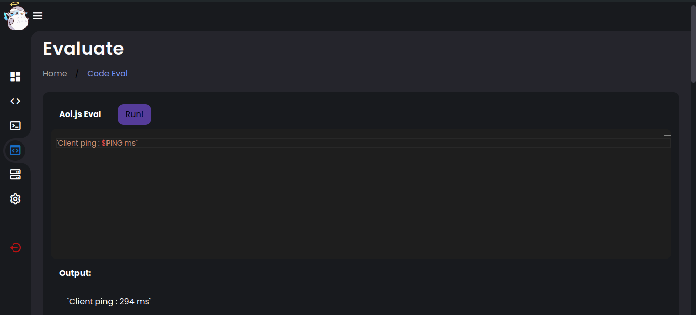
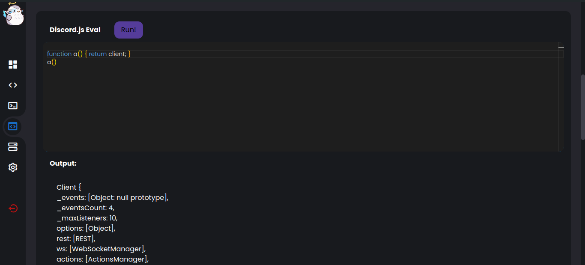

<p align="center">
  <a href="https://panel.aoijs.org">
    
  </a>
</p>

<h1 align="center">@aoijs/aoi.panel</h1>


### Table of Contents

- [Installation](#installation)
    - [Setup](#setup)

### Installation

```bash
npm i @aoijs/aoi.panel
```


### Setup

```javascript
const {Panel} = require("@aoijs/aoi.panel")
const {AoiClient} = require("aoi.js");

const client = new AoiClient({
    intents: ["MessageContent", "Guilds", "GuildMessages"],
    events: ["onMessage", "onInteractionCreate"],
    prefix: "Discord Bot Prefix",
    token: "Discord Bot Token",
    database: {
        type: "aoi.db",
        db: require("@akarui/aoi.db"),
        dbType: "KeyValue",
        tables: ["main"],
        securityKey: "a-32-characters-long-string-here",
    }
});

// Ping Command
client.command({
    name: "ping",
    code: `Pong! $pingms`
});

client.loadCommands("./commands/", true);


const panel = new Panel({
  port:3000,//port
  client:client,//aoi.js client
  accounts : "/panel.userconfig.js" //accounts file (for security reasons must be a separate file)
})

panel.loadPanel();

```

#### Example userconfig file for panel:

File: `panel.userconfig.js`
```js
module.exports = [
    {
        username: "administratorAccount",
        password: "adminpassword",
        perms: ["admin"]
    }, {
        username: "user",
        password: "user",
        perms: [ "startup"]
    }
]
```
##### Panel Main Page

##### Panel Code Editor

##### Panel Terminal

##### Panel Code evaluate




### Making Custom Pages
Panel uses the express.js framework. So all resources of express can be used while making custom pages e.t.c.
```javascript
const app = panel.app;
app.get("/example", (req, res) => {
    res.send("This is an example page.");
})
```
